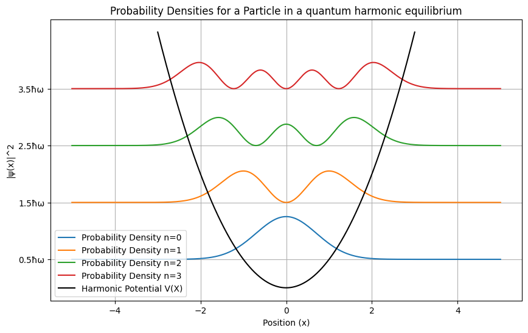

# Quantum Harmonic Oscillator

This repository provides a Python-based visualization of the quantum harmonic oscillator (QHO). The QHO is a fundamental system in quantum mechanics, describing particles bound in a parabolic potential well. This project models wavefunctions, and probability densities for the QHO using Hermite polynomials.

## Table of Contents

1. [Introduction](#introduction)
2. [Mathematical Framework](#mathematical-framework)
3. [Code Features](#code-features)
4. [Setup Instructions](#setup-instructions)
5. [Results and Visualizations](#results-and-visualizations)
6. [Conclusion](#conclusion)

## Introduction

The quantum harmonic oscillator is a cornerstone in quantum mechanics, describing systems ranging from molecular vibrations to quantum fields. This project focuses on:
- Visualizing the first few wavefunctions and their probability densities.
- Computing and displaying energy levels.

Key components include:
- Hermite polynomials for wavefunctions.
- Normalization factors for physical accuracy.
- Adjustable parameters (quantum state).

## Mathematical Framework

### WaveFunction
The wavefunctions of the QHO are expressed as:
$ \psi_n(X)=\frac{1}{\sqrt{2^nn!}\pi^\frac{1}{4}}H_n(X)e^\frac{-X^2}{2} $
where:
    H_n(X): Hermite Potential of order (n).
    X: Dimensionless position variable.

### Energy level
The energy of the nth quantum state is:
$ E_n=(n+\frac{1}{2})\hbar\omega $
where:
    $ \hbar $: Reduced Planck's constant.
    $ \omega $: Angular frequency.

### Probability Densities
The probability density is given by:
$ $ P(x)=\psi^*(x)\psi(x) $
where:
    $ psi^*(x) $: Wave Function

## Code Features

### Implemented Functions
1. **Wavefunction Generation:**
    - Computes $ \psi_n(X) $ for given n and X.

2. **Probability Density:**
    - Calculates $ P(x)=\psi^*(x)\psi(x) $.

3. **Energy levels:**
    - Computes $ E_n $ for given value of n.

### Adjustable Parameters
- **Dimensionless position (X)**: Position of the particle
- **Quantum state (n)**: Energy level for the given nth position.

## Setup Instructions
To run this project on your local machine, ensure that you have the necessary dependencies installed. The following steps outline how to set up the project:

1. Clone this repository:
```
git clone https://github.com/LINSANITY03/Quantum-Harmonic-Oscillation
```

2. Create a virtual environment:
```
python3 -m venv venv
source venv/bin/activate  # On Windows: venv\Scripts\activate
```

3. Install the required dependencies:
```
pip install -r requirements.txt
```

4. Usage
After installing the dependencies, go to notebooks folder:

```
cd notebooks
```
then, open the **main.ipynb** file.

The script will generate visualizations of the wavefunction for various quantum states, including energy levels and probability distributions.

You can modify the parameters in the script from **config.yml** to observe how the wavefunction changes with different particle energies level.

## Results and Visualizations
Plot of the wavefunctions and probability density for the first four quantum states.

<p align="center">
  
</p>

<p align="center">
  
</p>

## Conclusion
This project offers a detailed exploration of the quantum harmonic oscillator, a foundational concept in quantum mechanics. The following key insights were gained:

1. **Wavefunctions and Probability Densities:**
   - Wavefunctions exhibit characteristic shapes defined by Hermite polynomials.
   - Probability densities highlight regions of high likelihood for particle localization, with increasing nodes as quantum number increases.

2. **Energy Levels:**
   - The energy levels are evenly spaced, a hallmark of the harmonic oscillator potential.
   - The spacing between energy levels is directly proportional to the angular frequency (omega).

This visualization provides a robust foundation for understanding quantum oscillatory systems. It bridges theoretical concepts with computational insights, paving the way for future projects such as time evolution studies or comparisons with classical harmonic oscillators.

## Collaboration

Feel free to use this codebase for your projects. If you want to talk more about this project or have found bugs, create a pull request or contact me on **pujantamang92@gmail.com**.


